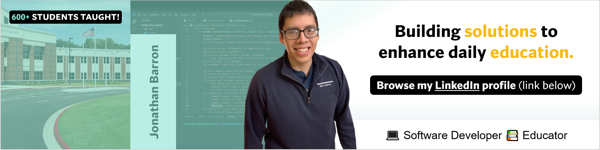

# 👋 Hi, I'm Jonathan!

## 🧠 EdTech Problem Solver

Leveraging code within EdTech tools accelerated my teaching career and fueled my passion for software development. My hands-on journey so far includes building no-code and backend solutions, with upcoming collaborative projects in data science and open-source. Tech I work with: Python, Pandas, Matplotlib.

**Let's Connect and have a Chat! 💬**

## 💻 Languages and Tools

| **Frontend** |   |
|----------|----------|
| **Backend**  |  |
| **Cloud**    |  |
| **Tools**    |   |

## 💼 Work Experience

**DevSecOps Fellow** @ ProgramEarth | Fellowship (remote) | 05/25 to Present
* In-progress

**Math Teacher** @ Fulton County Schools | Full-time (in-person) | 08/22 to Present
* Led print-to-digital curriculum overhaul for **230+** students using Desmos Scripting Language, boosting completion rates **8x** and reducing grading timelines by **70%** through automation scripts.

## 📈 Stakeholder Projects

**Software Developer** @ Catchafire | Volunteer Contractor (remote) | 05/25 to Present
* In-progress

##  Personal Projects

In-progress

## 🏅 Leadership & Affiliations

* **Code Reviews (Mentor):** [Refcode](https://refcode.org/) (2024)
* **Fellowships (Completed):** [AmeriCorps](https://www.americorps.gov/) (2017), [Teach for America](https://www.teachforamerica.org/) (2024), [The Knowledge House](https://www.theknowledgehouse.org/) (2025), [ProgramEarth](https://www.programearth.org/) (In-progress)

## 🎓 Education

**The University of Georgia** — BBA in Finance
